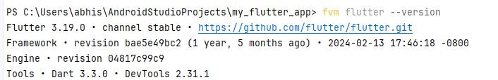

# my_flutter_app

A new Flutter project.

## Getting Started

This project is a starting point for a Flutter application.

A few resources to get you started if this is your first Flutter project:

- [Lab: Write your first Flutter app](https://docs.flutter.dev/get-started/codelab)
- [Cookbook: Useful Flutter samples](https://docs.flutter.dev/cookbook)

For help getting started with Flutter development, view the
[online documentation](https://docs.flutter.dev/), which offers tutorials,
samples, guidance on mobile development, and a full API reference.

## How to run ?

### Input sheet correction
1. prepare the input sheet -sample input sheet attached in assets folder
2. make sure to write age/sex column as '62Y/M' otherwise the scheduled output won't get stored in database.

### Terminal commands
1. this project is made using flutter version - 3.19.0.



2. So, if you have multiple flutter versions then you should run as below:
    * `fvm flutter run`
    * then chose chrome or other browser

### Existing users and credentials
* otadmin@gmail.com
* demonurse@gmail.com
* demomanager@gmail.com 
* password- admin


---

## Deployment to Amrita Server

### For a Flutter Web App

#### Build the Web App
   Open your terminal in the project root and run the build command. This creates a compiled, production-ready version of your web app with all the static files. 

    ```flutter build web```

   This command generates a `build/web` directory in your project folder. This folder contains all the static files (HTML, CSS, JS, assets) needed to run your app.

#### Copy Files to the Server
Copy the entire contents of your `build/web` folder to the web root directory of your server .

**Using SCP (Secure Copy)**
```
   # SSH into server (using existing user souvik alreday created)
   C:\Users\abhis\AndroidStudioProjects\my_flutter_app> ssh souvik@10.125.11.203 
   Note : type yes if prompted for  anything 
   
   # Create directory in Nginx web root
   souvik@ai-testserver-3:~$ sudo mkdir -p /usr/share/nginx/html/your-app-folder(ot-scheduler)
   
   ## Temporarily give yourself ownership to copy files in case you don't have
   souvik@ai-testserver-3:~$ sudo chown souvik:souvik /usr/share/nginx/html/ot-scheduler
   
   # logout
   souvik@ai-testserver-3:~$ exit

   # Copy files to web directory on the server
   <scp -r build/web/* username@server-ip:/usr/share/nginx/html/your-app-folder/>
   scp -r build/web/* souvik@10.125.11.203:/usr/share/nginx/html/ot-scheduler/
   
   # Fix permissions for Nginx
   ssh souvik@10.125.11.203
   sudo chown -R www-data:www-data /usr/share/nginx/html/ot-scheduler/
   sudo chmod -R 755 /usr/share/nginx/html/ot-scheduler/
   exit
   
   
```

#### Check Available Ports

```markdown
# Check which ports are available
sudo ss -tulpn | grep LISTEN

# Check specific common ports
for port in 8080 3000 5000 8000 8085 8086 8095 9000; do
    if ! sudo ss -tulpn | grep -q ":${port} "; then
        echo "✅ Port $port is AVAILABLE"
    fi
done
```

#### Create Nginx Configuration

```markdown
# Create configuration file (replace PORT_NUMBER with chosen port)
sudo nano /etc/nginx/sites-available/your-app-name

**Configuration Template:**

nginx
server {
listen PORT_NUMBER;  # e.g., 3000, 5000, etc.
server_name your-server-ip;

    root /usr/share/nginx/html/your-app-folder;
    index index.html;
    
    location / {
        try_files $uri $uri/ /index.html;
    }
}

# sample config file
1. first i run the command `sudo nano /etc/nginx/sites-available/ot-scheduler-frontend` as below:
souvik@ai-testserver-3:/$ sudo nano /etc/nginx/sites-available/ot-scheduler-frontend
   
# pasted below contents   
server {
listen 8080;
server_name 10.125.11.203;

    root /usr/share/nginx/html/ot-scheduler;
    index index.html;

    location / {
        try_files $uri $uri/ /index.html;
    }
}

# saved the chnages


```

#### Enable the site
```markdown
# Create symbolic link to enable site
sudo ln -s /etc/nginx/sites-available/your-app-name /etc/nginx/sites-enabled/

# Test Nginx configuration
sudo nginx -t

# If test passes, reload Nginx
sudo systemctl reload nginx
```


#### Access the App
On any computer within your office network, open a web browser and navigate to your server's IP address alongwith port number.
` http://your-server-ip:PORT_NUMBER `


#### Local Deployment

   Your office server needs web server software to serve the files. Common, easy-to-use options are:

   * Apache HTTP Server: Very common and powerful.

   * Nginx: Known for its high performance.

   * Python's Simple HTTP Server: Great for quick testing (no installation needed if Python is already there).

   * Node.js http-server: Another simple, zero-configuration command-line server.

   **Run the local development server from your machine (if you node.js installed)**

   ```markdown
   # Install the http-server package
   npm install -g http-server
    
   # Navigate to your built Flutter web folder
   cd build/web
    
   # Start the server (see output as below)
   http-server -p 8080
     
   # Output
   C:\Users\abhis\AndroidStudioProjects\my_flutter_app\build\web> http-server -p 8080
   Starting up http-server, serving ./
        
   http-server version: 14.1.1
   http-server settings:
   CORS: disabled
   Cache: 3600 seconds
   Connection Timeout: 120 seconds
   Directory Listings: visible
   AutoIndex: visible
   Serve GZIP Files: false
   Serve Brotli Files: false
   Default File Extension: none
   Available on:
   http://192.168.240.134:8080
   http://127.0.0.1:8080
   Hit CTRL-C to stop the server
           
   ```

   **Run the local development server from your machine (if you have python installed)**
   ```markdown
        
   # Navigate to your built Flutter web folder
   cd build/web

   # Start the server (you 'll see output same as previous one
   python -m http.server 8000
    
   ```

---

### Re-Deployment Process

1. **Build the Updated Web App**
```bash
   # In your Flutter project root directory
flutter build web --release
```

2. **Copy Updated Files to Server**
```bash
# Copy all updated files to the server
scp -r build/web/* souvik@10.125.11.203:/usr/share/nginx/html/ot-scheduler/
```
3. **Resolve Errors(if any)**
```
# User may not have write permissions
C:\windows\System32\OpenSSH\scp.exe: dest open "/usr/share/nginx/html/ot-scheduler/assets/AssetManifest.bin.json": Permission denied
```

**Solution**
* Temporarily change ownership
```bash
# SSH into server
ssh souvik@10.125.11.203

# Change ownership to souvik temporarily
sudo chown -R souvik:souvik /usr/share/nginx/html/ot-scheduler/

# Exit SSH
exit
```
* Now copy your files:
```bash
# Copy all files from your local machine
scp -r build/web/* souvik@10.125.11.203:/usr/share/nginx/html/ot-scheduler/
```

* After copying, fix permissions back:
```bash
# SSH back and fix permissions
ssh souvik@10.125.11.203

# Change ownership back to www-data for Nginx
sudo chown -R www-data:www-data /usr/share/nginx/html/ot-scheduler/

# Set correct permissions
sudo chmod -R 755 /usr/share/nginx/html/ot-scheduler/

# Exit
exit
```
* Verify the deployment
```bash
# you can see that files have updated date
ssh souvik@10.125.11.203 "ls -la /usr/share/nginx/html/ot-scheduler/"   
```

* Clear Browser Cache
Since it's a Flutter web app, users might need to clear their browser cache to see the updated version:
  * Chrome/Firefox/Edge: Ctrl+Shift+R (or Ctrl+F5) for hard refresh 
  * You can also ask users to clear cache manually
---

