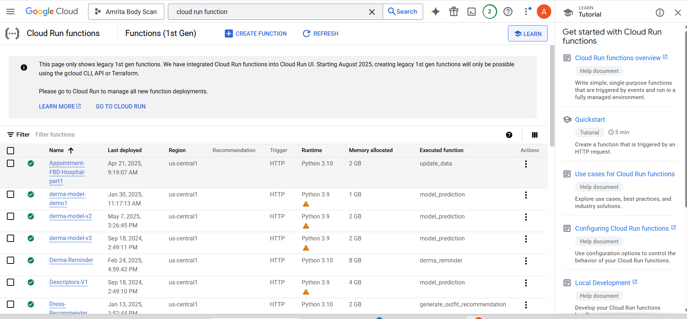
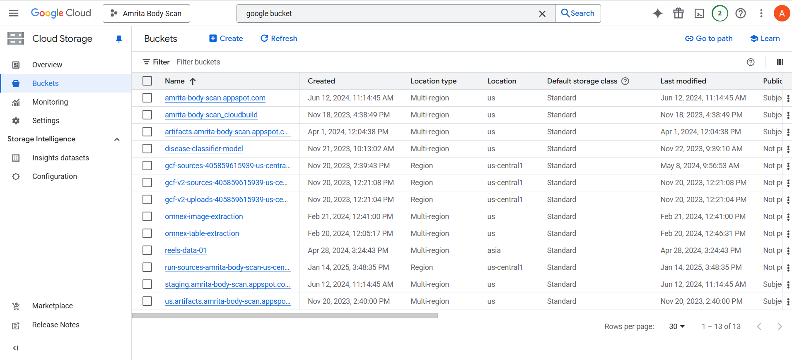

# OT Scheduler

## For scheduling algorithm
* go to GCP
* search for `cloud run function` in search bar --select 1st gen functions (you should see something like this)
* if you see multiple OT scheuler functions then check for the one from the fronetnd app(`SchedulerInput.dart)` file
* for bucket (refer below screenshots for help)

* __for selecting disease classifier model__

### Rules for OT schdeuling

* Initial scheduling from the Outpatient Department (OPD).
* Mandatory financial and pre-anesthetic clearances (PAC) before surgery.
* Priority allocation for critical and emergency surgeries to ensure optimal OT usage and patient care.
* Operating hours for surgeries are from 8:00 AM to 6:00 PM.
* A 30-minute interval is required between consecutive surgeries for preparation and cleaning.
* Surgeries must occur in their designated OTs as outlined in the OT preferences
* Prioritize child surgeries first and infectious disease surgeries last for safety and containment.
* General surgeries are eligible for scheduling in OTs 1, 2, and 11.

## Useful links
1. OT preferences -`https://docs.google.com/spreadsheets/d/1RngCiO0Fz9eBI70GVn40F5gAGsIGOaDX/edit?gid=768737724#gid=768737724`
2. Live testing results -`https://docs.google.com/document/d/1AePFSBulj7aDQ3z8C_Me1aup-6CLW7QLk1pVn7eYOD4/edit?tab=t.0#heading=h.a5w6yfiwkmwu`
3. OT scheduling design doc-`https://docs.google.com/document/d/1kATcO_QYr_nfNqNWpKn_tmMLRs20v3GUAXIGj00MV6Q/edit?tab=t.0#heading=h.qgp1riysz65g`
4. Datasets(Aug'22 - Dec'23)- `https://docs.google.com/spreadsheets/d/1YRT43xB5RKzN0Lunqx6-rCQAd3vLgHv-/edit?gid=723304217#gid=723304217`
5. Current issues in datasets - `https://docs.google.com/spreadsheets/d/1M8C3aNeK46VgaOJy9k3JrnaSiLAv5MH2/edit?gid=1865701229#gid=1865701229`
6. Minutes of meeting -`https://docs.google.com/document/d/1ZAEznyDijwbOsrOJtUPjzKnxoHowxdKu_21wDL5ycxg/edit?tab=t.0#heading=h.qkm1b3qo68x9`
7. backend hosting on cloud -`https://docs.google.com/document/d/1i9Y9IjnIGdmi7bWBjTd-QLoeWAQZy6LGytTyFBAooVA/edit?tab=t.0`
8. procedure duration -`https://docs.google.com/spreadsheets/d/1Cb6bz7YlrH2JbrhCr90ZRpmr2YJ29134/edit?gid=1944715635#gid=1944715635`
9. special equipment - `https://docs.google.com/spreadsheets/d/1CTVE6k0hyE2qzxTIJP2Xz2s2b7nXOLCA/edit?gid=695958715#gid=695958715`
10. Anaesthesia types -`https://docs.google.com/spreadsheets/d/1wZG5bgmRtD-b1WtSXi3AbfvgN9p6ZaQGJp4-K9VTW90/edit?gid=0#gid=0`
11. Seperate Surgeries -Doctor wise - `https://docs.google.com/spreadsheets/d/1ISpEvDNATtolL5vil3lDzIgmdwaPZNYv/edit?gid=1445120167#gid=1445120167`
12. antibiotic prophylaxis - `https://docs.google.com/spreadsheets/d/1DwCPrAZ3zw587BPH1tUmZGGVF_UnMmU5/edit?gid=230173100#gid=230173100`
13. schedule of charges -surgery list,code  and department - `https://docs.google.com/spreadsheets/d/1dgVDHwIdqy0aRQUWkssuHmWUtkOAvjRa/edit?gid=566040837#gid=566040837`

