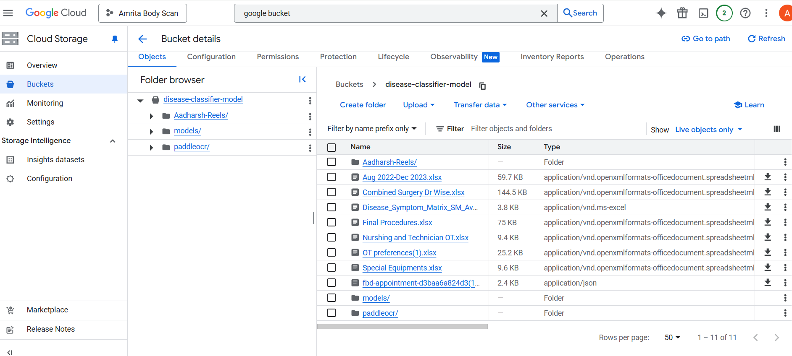

# OT Scheduler — Backend

Django REST Framework API for the OT Scheduler application. It handles authentication, stores scheduling domain data (doctors, operating theatres, patients, procedures, scheduled surgeries, monitoring records, OT staff), runs the OT scheduling algorithm, and serves analytics endpoints consumed by the [frontend](../frontend).

See the repository-level [README](../README.md) for how this project fits into the monorepo, and [docs/architecture.md](../docs/architecture.md) for how it interacts with the frontend and the scheduling algorithm's business rules.

## Technology Stack

- **Language:** Python
- **Framework:** Django + Django REST Framework
- **Auth:** `djangorestframework-simplejwt` (JWT), with a custom user model (`OT_Scheduling.CustomUser`)
- **Database:** SQLite by default (`django.db.backends.sqlite3`), configured in `OT/settings.py`. A commented-out MySQL configuration is also present but inactive.
- **CORS:** `django-cors-headers`
- **Other libraries:** `openpyxl`, `pandas`, `numpy` (Excel processing / scheduling algorithm), `gunicorn` (WSGI server for deployment), `django-otp`

Full dependency list: [`requirements.txt`](requirements.txt).

## Prerequisites

- Python 3.x with `pip`
- (Optional) a virtual environment tool such as `venv`

## Local Development Setup

```bash
cd backend

# Create and activate a virtual environment
python -m venv venv
venv\Scripts\activate      # Windows
source venv/bin/activate   # macOS/Linux

# Install dependencies
pip install -r requirements.txt
```

## Environment Configuration

The backend currently reads all configuration directly from `OT/settings.py` — there is no `.env` file or environment-variable loading in this project (no `python-dotenv`/`os.environ` usage). Notable hardcoded values in `OT/settings.py` that you may need to adjust for your machine:

| Setting | Notes |
|---|---|
| `SECRET_KEY` | Django secret key, currently a fixed dev value |
| `DEBUG` | `True` by default |
| `ALLOWED_HOSTS` | Fixed list of hostnames/IPs; add your own host if needed |
| `DATABASES` | SQLite by default; MySQL block present but commented out |
| `CORS_ALLOW_ALL_ORIGINS` | `True` by default |

No required environment variables are defined at this time.

## Database Setup / Migrations

```bash
python manage.py makemigrations
python manage.py migrate
```

This creates/updates `db.sqlite3` in the `backend/` directory using the migrations already present in `OT_Scheduling/migrations/`.

To create an admin user for the Django admin site:

```bash
python manage.py createsuperuser
```

## Running the Backend Locally

```bash
python manage.py runserver
```

By default this serves the API at `http://localhost:8000/`, with all application endpoints under `http://localhost:8000/api/` (see `OT/urls.py`).

## Running Tests

Django's test scaffolding is present at `OT_Scheduling/tests.py`, but no tests are currently implemented.

```bash
python manage.py test
```

## Project Structure

```
backend/
├── OT/                     # Django project (settings, root URLs, WSGI/ASGI entrypoints)
├── OT_Scheduling/          # Main Django app
│   ├── models.py           # Doctors, OTs, patients, procedures, schedules, monitoring, staff
│   ├── views.py            # API views (auth, CRUD, analytics, scheduler, Excel processing)
│   ├── serializers.py      # DRF serializers
│   ├── urls.py              # /api/ route definitions
│   ├── algorithm.py        # OT scheduling algorithm
│   ├── permissions.py      # DRF permission classes
│   ├── migrations/         # Django migrations
│   └── assets/              # Reference screenshots/assets used in this README
├── data/, docs/             # Sample input/reference spreadsheets (not source code)
├── manage.py
├── requirements.txt
└── db.sqlite3               # Default SQLite database file
```

## API Information

The full API reference — every endpoint, request/response examples, and the error code reference — is in [`API_CATALOGUE.md`](API_CATALOGUE.md).

Quick facts:
- **Base URL:** `http://<host>/api/`
- **Auth:** JWT Bearer token, except endpoints explicitly marked public in the catalogue
- **Date format:** `YYYY-MM-DD` for query params; `MM/DD/YYYY` for surgery/patient dates in request/response bodies

## Scheduling Algorithm Notes

The business rules the scheduling algorithm implements (priority order, OT eligibility, shift timing, buffers, etc.) are documented in [docs/architecture.md](../docs/architecture.md#scheduling-algorithm--business-rules) to avoid duplicating them here.

### Legacy Cloud Function Reference

Earlier project notes describe running the scheduling algorithm as a GCP Cloud Run function, selectable from the frontend's `SchedulerInput.dart`, with a separate disease-classifier model bucket:


*Selecting the disease classifier model:*




This repository's current backend runs the scheduling algorithm in-process (`OT_Scheduling/algorithm.py`, invoked via `/api/ot-schedule/`) rather than as a separate cloud function; the screenshots above are kept for historical reference.

## Useful Links

Reference spreadsheets and design docs used during development of the scheduling logic:

1. OT preferences — `https://docs.google.com/spreadsheets/d/1RngCiO0Fz9eBI70GVn40F5gAGsIGOaDX/edit?gid=768737724#gid=768737724`
2. Live testing results — `https://docs.google.com/document/d/1AePFSBulj7aDQ3z8C_Me1aup-6CLW7QLk1pVn7eYOD4/edit?tab=t.0#heading=h.a5w6yfiwkmwu`
3. OT scheduling design doc — `https://docs.google.com/document/d/1kATcO_QYr_nfNqNWpKn_tmMLRs20v3GUAXIGj00MV6Q/edit?tab=t.0#heading=h.qgp1riysz65g`
4. Datasets (Aug'22 – Dec'23) — `https://docs.google.com/spreadsheets/d/1YRT43xB5RKzN0Lunqx6-rCQAd3vLgHv-/edit?gid=723304217#gid=723304217`
5. Current issues in datasets — `https://docs.google.com/spreadsheets/d/1M8C3aNeK46VgaOJy9k3JrnaSiLAv5MH2/edit?gid=1865701229#gid=1865701229`
6. Minutes of meeting — `https://docs.google.com/document/d/1ZAEznyDijwbOsrOJtUPjzKnxoHowxdKu_21wDL5ycxg/edit?tab=t.0#heading=h.qkm1b3qo68x9`
7. Backend hosting on cloud — `https://docs.google.com/document/d/1i9Y9IjnIGdmi7bWBjTd-QLoeWAQZy6LGytTyFBAooVA/edit?tab=t.0`
8. Procedure duration — `https://docs.google.com/spreadsheets/d/1Cb6bz7YlrH2JbrhCr90ZRpmr2YJ29134/edit?gid=1944715635#gid=1944715635`
9. Special equipment — `https://docs.google.com/spreadsheets/d/1CTVE6k0hyE2qzxTIJP2Xz2s2b7nXOLCA/edit?gid=695958715#gid=695958715`
10. Anaesthesia types — `https://docs.google.com/spreadsheets/d/1wZG5bgmRtD-b1WtSXi3AbfvgN9p6ZaQGJp4-K9VTW90/edit?gid=0#gid=0`
11. Separate surgeries — doctor-wise — `https://docs.google.com/spreadsheets/d/1ISpEvDNATtolL5vil3lDzIgmdwaPZNYv/edit?gid=1445120167#gid=1445120167`
12. Antibiotic prophylaxis — `https://docs.google.com/spreadsheets/d/1DwCPrAZ3zw587BPH1tUmZGGVF_UnMmU5/edit?gid=230173100#gid=230173100`
13. Schedule of charges — surgery list, code, department — `https://docs.google.com/spreadsheets/d/1dgVDHwIdqy0aRQUWkssuHmWUtkOAvjRa/edit?gid=566040837#gid=566040837`

## Deployment

Manual deployment steps (GitHub → server via WinSCP/SCP, systemd service restart) are documented in [`Backend_Deployment_README.md`](Backend_Deployment_README.md).