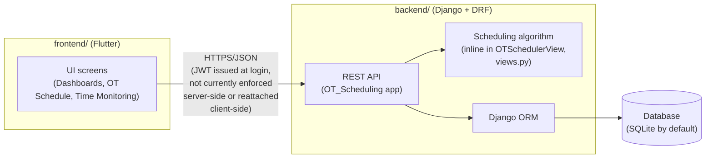

# Architecture Overview

## System Overview

OT Scheduler is a two-tier application:

- **[`frontend/`](../frontend)** — a Flutter app (web, Android, iOS, Windows) that surgical/OT staff use to upload surgery lists, review generated schedules, monitor OT progress, and view analytics dashboards.
- **[`backend/`](../backend)** — a Django REST Framework API that handles authentication, stores scheduling data (doctors, OTs, patients, procedures, scheduled surgeries, monitoring records), runs the scheduling algorithm, and serves analytics endpoints.

The frontend talks to the backend exclusively over HTTP via the REST API defined in [`backend/API_CATALOGUE.md`](../backend/API_CATALOGUE.md). The API base URL is configured in [`frontend/lib/config/constants.dart`](../frontend/lib/config/constants.dart).

## Request Flow

1. The Flutter client authenticates against `/api/login/` (or `/api/register/`) and receives a JWT access/refresh token pair, per [`backend/API_CATALOGUE.md`](../backend/API_CATALOGUE.md#1-authentication).
2. **This JWT is not currently attached to any subsequent request by the client, and every backend `ModelViewSet` has its authorization check commented out (`permission_classes = [IsAuthenticated]`, `backend/OT_Scheduling/views.py:89,119,152,174,220,256,375`), with no `DEFAULT_PERMISSION_CLASSES` set in `REST_FRAMEWORK`.** In practice the API is open to any caller today — see [`docs/PRD.md`](PRD.md) §3/§5 (Gap #1/#2) for the full, code-verified finding. `rest_framework_simplejwt` is wired up and *would* validate a Bearer token if one were sent, but nothing in the current codebase sends one after login.
3. CRUD endpoints (doctors, OTs, patients, procedures, schedules, monitoring, staff) are standard DRF `ModelViewSet`s backed by the Django ORM.
4. To generate a schedule, the client uploads an Excel surgery list to `/api/ot-schedule/`; the backend runs the scheduling algorithm **inline inside `OTSchedulerView.post()`** (`backend/OT_Scheduling/views.py:1902-2371`) and returns the computed schedule. (`backend/OT_Scheduling/algorithm.py`, an older Google-Cloud-Storage-based implementation, was dead code — not imported anywhere — and has been removed; see [`docs/scheduling-workflow.md`](scheduling-workflow.md) for the live algorithm's full trace.)
5. Analytics endpoints aggregate data from scheduled surgeries and monitoring records for dashboard charts in the frontend.

## Scheduling Algorithm — Business Rules

These rules are re-verified against the **live** algorithm, `OTSchedulerView.post()`'s `priority_surgery()`/`scheduled_procedure()` (`backend/OT_Scheduling/views.py:1955-2178`) — see [`docs/scheduling-workflow.md`](scheduling-workflow.md) §7 for the full line-cited breakdown:

- Operating hours run from 8:00 AM to midnight, split into a day shift (08:00–18:00) and a night shift (18:00–24:00).
- A 30-minute buffer is enforced after each surgery in the same OT before the next one can start.
- Surgeries are placed only in OTs preferred by their department, per `OT preferences(1).xlsx`.
- Within a shift, surgeries are sorted by priority: duration > 10 hours first (by age ascending), then paediatric cases under 12 (by age ascending), then the rest by duration (descending).
- Doctor and patient double-booking is prevented; special equipment availability is tracked per time slot, per equipment unit.
- Surgeries that cannot be placed in any preferred OT/phase are computed (`unscheduled_result`) but **not currently returned to the frontend** — see `docs/PRD.md` Gap #3.

The following rules appeared in an earlier version of this document, sourced from the now-removed `algorithm.py` and outside project notes rather than the live code. They are **not corroborated by the current `OTSchedulerView` implementation** and are listed here only so they aren't silently lost — treat them as unconfirmed, not as current behavior, until someone with product knowledge confirms whether they're intended:

- "Initial scheduling originates from the Outpatient Department (OPD)" — no OPD concept exists anywhere in the current schema or code.
- "Mandatory financial and pre-anesthetic clearances (PAC) are required before surgery" — contradicted: `PAC Status` is an optional column that defaults to `'NA'` if blank and does not block scheduling (`views.py:2194-2202`).
- "Infectious-disease surgeries are scheduled last for containment" — no infection/containment field or sort key exists anywhere in the current priority logic.
- "General surgeries are eligible for OTs 1, 2, and 11" — OT eligibility is determined entirely by the `OT preferences(1).xlsx` department join; no OT numbers are hardcoded anywhere in `views.py`.

For the full analysis behind this correction, see [`docs/architecture-and-data-model-review.md`](architecture-and-data-model-review.md) §2.

Full endpoint-level detail (including the exact request/response shape for the scheduler and Excel-parsing endpoints) is in [`backend/API_CATALOGUE.md`](../backend/API_CATALOGUE.md#17-ot-scheduler-algorithm).

## Data Storage

The backend uses Django's ORM and defaults to SQLite (`backend/db.sqlite3`), configured in `backend/OT/settings.py`. A commented-out MySQL configuration is also present in that file but is not active by default.