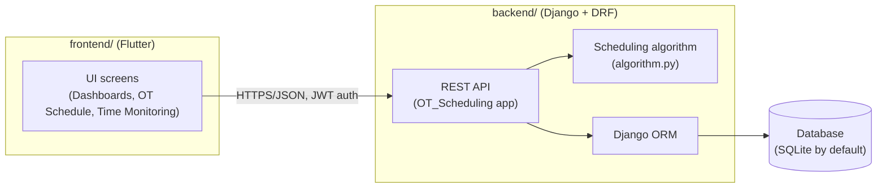

# Architecture Overview

## System Overview

OT Scheduler is a two-tier application:

- **[`frontend/`](../frontend)** — a Flutter app (web, Android, iOS, Windows) that surgical/OT staff use to upload surgery lists, review generated schedules, monitor OT progress, and view analytics dashboards.
- **[`backend/`](../backend)** — a Django REST Framework API that handles authentication, stores scheduling data (doctors, OTs, patients, procedures, scheduled surgeries, monitoring records), runs the scheduling algorithm, and serves analytics endpoints.

The frontend talks to the backend exclusively over HTTP via the REST API defined in [`backend/API_CATALOGUE.md`](../backend/API_CATALOGUE.md). The API base URL is configured in [`frontend/lib/config/constants.dart`](../frontend/lib/config/constants.dart).

## Request Flow

1. The Flutter client authenticates against `/api/login/` (or `/api/register/`) and receives a JWT access/refresh token pair, per [`backend/API_CATALOGUE.md`](../backend/API_CATALOGUE.md#1-authentication).
2. Subsequent requests attach the JWT as a Bearer token; `rest_framework_simplejwt` validates it (see `REST_FRAMEWORK` / `AUTH_USER_MODEL` in `backend/OT/settings.py`).
3. CRUD endpoints (doctors, OTs, patients, procedures, schedules, monitoring, staff) are standard DRF `ModelViewSet`s backed by the Django ORM.
4. To generate a schedule, the client uploads an Excel surgery list to `/api/ot-schedule/`; the backend runs the scheduling algorithm (`backend/OT_Scheduling/algorithm.py`) and returns the computed schedule.
5. Analytics endpoints aggregate data from scheduled surgeries and monitoring records for dashboard charts in the frontend.

## Scheduling Algorithm — Business Rules

These rules govern how the backend's scheduling algorithm assigns surgeries to OTs (source: `backend/OT_Scheduling/algorithm.py` and prior project documentation):

- Initial scheduling originates from the Outpatient Department (OPD).
- Mandatory financial and pre-anesthetic clearances (PAC) are required before surgery.
- Critical and emergency surgeries receive priority allocation for optimal OT usage and patient care.
- Operating hours run from 8:00 AM to 6:00 PM, split into a day shift (08:00–18:00) and a night shift (18:00–24:00).
- A 30-minute buffer is enforced between consecutive surgeries in the same OT for preparation and cleaning.
- Surgeries must occur in their designated OTs, per department OT preferences.
- Paediatric surgeries (age < 12) are prioritized first; infectious-disease surgeries are scheduled last for containment.
- General surgeries are eligible for OTs 1, 2, and 11.
- Within a shift, surgeries are sorted by priority: longest duration first, then paediatric cases, then remaining cases by duration (descending).
- Doctor and patient double-booking is prevented; special equipment availability is tracked per time slot.

Full endpoint-level detail (including the exact request/response shape for the scheduler and Excel-parsing endpoints) is in [`backend/API_CATALOGUE.md`](../backend/API_CATALOGUE.md#17-ot-scheduler-algorithm).

## Data Storage

The backend uses Django's ORM and defaults to SQLite (`backend/db.sqlite3`), configured in `backend/OT/settings.py`. A commented-out MySQL configuration is also present in that file but is not active by default.